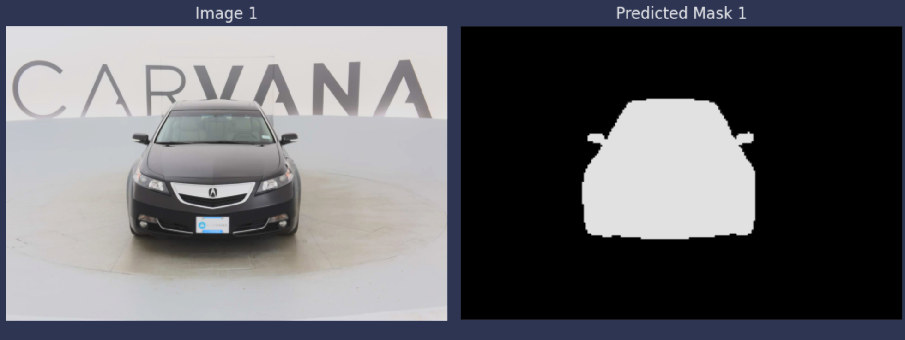

<h1>Car Semantic Segmentation</h1>

 

Car segmentation using UNET.

<h3>Built With</h3>

+ [Python](https://www.python.org/downloads/)
  
<h3>About the Dataset</h3>

The [Dataset](https://www.kaggle.com/c/carvana-image-masking-challenge/data) contains images of cars and their labels (segmentation masks).
Here are the dataset statistics:

| Split | Number of Images |
|-------|------------------|
| test  | 100064           |
| train | 5040             |
| val   | 48               |

### Results (Validation Set Evaluation)

VAL Loss: 0.0070, Dice coefficient: 0.9929, Pixel Acc: 0.9973

### Contact Me

[Linkedin](https://www.linkedin.com/in/dahshory/)

### Acknowledgements

Thanks to [Samir Gouda](github.com/SamirGouda) & [Omar Eldahshoury](github.com/omareldahshoury) for thier support.